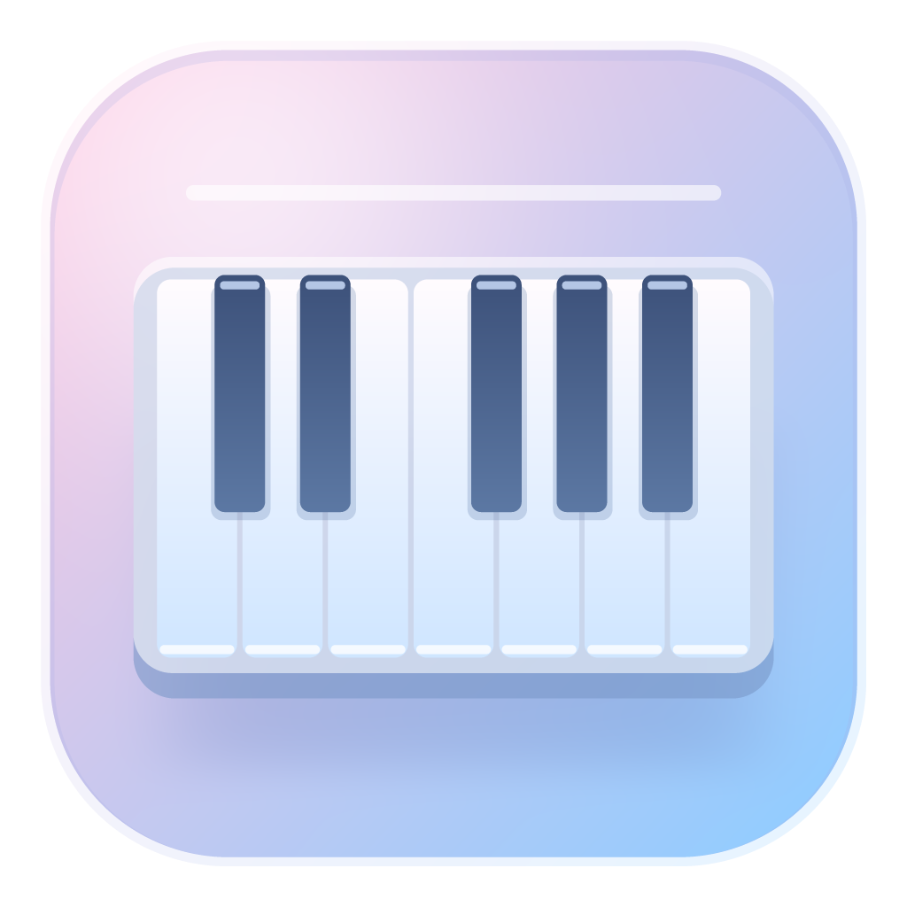
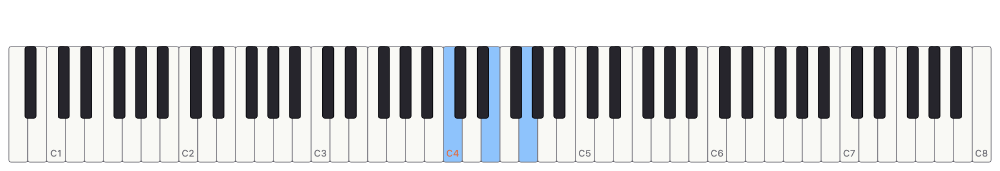
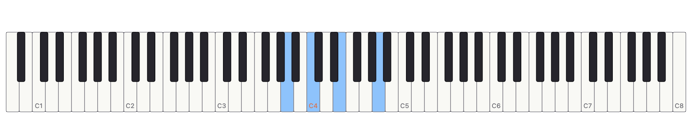
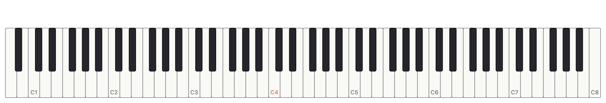

  

# Just Piano

**Open. Play. Keep the take.** A piano for your MIDI keyboard—or just your computer keys.

**Five instruments · 88 keys · Five reverb spaces · MIDI & WAV recording**

[**Download Just Piano →**](https://github.com/jing1ei/justpiano/releases)

*The first packaged release is not published yet. Downloads will appear on this page when ready.*

## Download and open

| Your computer | Choose this download | Open it |
|---|---|---|
| Mac with Apple Silicon (M1 or later) | `JustPiano-1.0.0-macOS-arm64.dmg` | Open the DMG and drag JustPiano into Applications. |
| Mac with an Intel processor | `JustPiano-1.0.0-macOS-x64.dmg` | Open the DMG and drag JustPiano into Applications. |
| Windows PC, 64-bit | `JustPiano-1.0.0-Windows-x64.zip` | Extract the whole ZIP, then open `JustPiano/JustPiano.exe`. |

Packaged apps include everything needed to run. Compatibility targets are macOS 11+ and Windows 10+; verification on those oldest systems is still pending. Mac builds are ad-hoc signed, not notarized.

## Play → choose a sound → save

1. **Open the keyboard.** Mac: click 🎹 in the menu bar. Windows: click the piano in the window.
2. **Play.** Connect a MIDI keyboard, click/drag the keys, or use **A W S E D F T G Y H U J K O L P ;** for C4–E5. Click lower for a louder note.
3. **Choose a sound.** Mac: **⚙ → Sound → Instrument**. Windows: **Instrument** at the top.
4. **Keep the take.** **Record → play → Stop → Export MIDI or WAV**.

On Mac, right-click 🎹 also opens the settings menu. If menu-bar overflow hides the icon, the piano opens in a small window instead. Escape closes the Mac keyboard; on Windows it releases notes without closing the window.

## Five sounds, your room

| Grand | Upright | Felt | Rhodes | Wurlitzer |
|---|---|---|---|---|
| Clear Yamaha C5 | Intimate Kawai | Soft and dark | Rounded, bell-like electric | Reedy electric with bite |

**Reverb:** Studio · Room · Warm Chamber · Concert Hall · Ambient · Off. Adjust volume, touch response and key noise to suit your playing. First use briefly prepares the selected sound.

## Keep the idea

- **Export MIDI** saves editable notes and pedal movements.
- **Export WAV** saves stereo audio using the currently selected instrument and effects.
- Forgot Record? Use **Export Everything Since Launch** on Mac or **Export session** on Windows.
- **Open Recordings Folder** takes you to saved files. The default is **Music → Just Piano**.

**Export before quitting.** Takes are kept in memory. Starting a new take replaces the previous one; the rolling session keeps the latest 400,000 MIDI events. Sound changes during a take are not recorded as audio. Play exported files in your player or DAW.

## Mute, without losing the notes

**Mute** silences playback while capture continues. **Panic** stops stuck notes. Mac also offers **⌃⌥⌘M**; enable Accessibility from **Mute Hotkey** to use it outside the app. Windows uses the Mute button.

## Quick fixes

| Problem | Try this |
|---|---|
| No sound | Wait for loading, unmute, raise volume, choose Audio Output, then click a piano key. |
| Keyboard not found | Reconnect, choose Rescan, then select the MIDI input. |
| Crackles | Increase Latency / Buffer to 512 frames; use wired audio. |
| Stuck note | Press Panic. |
| Export unavailable | Stop the take first. For WAV, wait for the sound to finish loading. |
| Mac blocks opening | Use macOS's Open / Privacy & Security flow only for a download you trust. |

Windows currently has no tray mode, global mute shortcut, virtual MIDI port or launch-at-login setting. MIDI channels share one instrument; pitch bend/modulation are saved to MIDI but do not affect playback. Aftertouch and program changes are ignored.

*Images are captures of the actual macOS keyboard component with staged demonstration states, not live-session screenshots. Windows uses a separate window layout.*

## Audio credits and rights

- **Grand / Felt:** [Salamander Grand Piano V3](https://archive.org/details/SalamanderGrandPianoV3), by **Alexander Holm**, [CC BY 3.0](https://creativecommons.org/licenses/by/3.0/). Yamaha C5 recordings. This app selects velocity layers, trims/resamples and packages them as FLAC; Felt adds filtering and an envelope. Keep this attribution with the recordings.
- **Upright:** [Upright Piano KW](https://freepats.zenvoid.org/Piano/acoustic-grand-piano.html#UprightKW), by **Gonzalo and Roberto / FreePats**, [CC0 1.0](https://creativecommons.org/publicdomain/zero/1.0/). Kawai recordings, trimmed/resampled, with velocity-layer pitch alignment and tonal filtering.
- **Rhodes / Wurlitzer:** synthesized by this project's engine; no third-party recordings.

Original project code: © 2026, **all rights reserved**. No license to use, copy, modify or redistribute the code is granted. Bundled audio retains its separate terms above.

## Automatic downloads

Every successful build from a push to `main` refreshes the public **1.0.0** release.
All required platform builds and checks must pass first. Downloads use
`App-1.0.0-OS-architecture.ext`, such as `App-1.0.0-macOS-universal.zip`
or `App-1.0.0-Windows-x64.exe`. See [release automation](.github/RELEASES.md)
for the exact packages, checksums, and retry behavior.
